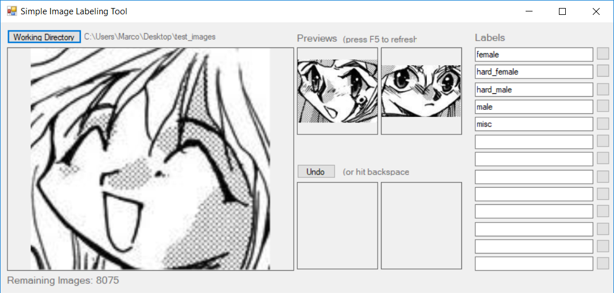

# Simple Image Labeling Tool (SILT)

SILT is a very trivial tool to help labeling images. It's not a complete software product, which secures any potential wrong interactions by the user (e.g. opening a directory with other files than images).

# Features

- Assigns labels by moving the image to its subdirectory
- Reads labels if subdirectories are present in the working directory
- Undo function
- Supports 26 labels

# Usage

- Choose a working directory
- Write labels into the input fields or create subdirectories before choosing the working directory
- Hit the button next to the label input field to assign that label to the image
- Press F5 to refresh
- Press F8 or hit the Undo button for undoing the last label